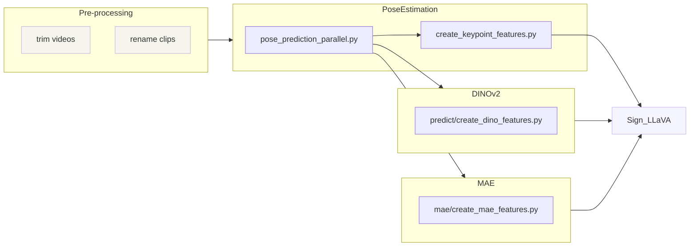

## [PoseEstimation](https://github.com/JSALT2024/PoseEstimation)
### pose_prediction_parallel.py
```bash
python pose_prediction_parallel.py \
    --input_folder data/clips \
    --output_folder data/cropped_clips \
    --tmp_folder data/tmp_clips \
    --num_index_files 100 \
    --index_path data/index_files \
    --index_file_id 0 \
    --checkpoint_folder checkpoints \
    --sign_space 4 \
    --yolo_sign_space 4
```

### create_keypoint_features.py
```bash
python create_keypoint_features.py \
  --input_folder data/cropped_clips \
  --output_folder data/features \
  --dataset_name yt \
  --split_name train 
```


## [DINOv2](https://github.com/JSALT2024/DINOv2)
### predict/create_dino_features.py
```bash
python predict/create_dino_features.py \
  --input_folder data/cropped_clips \
  --output_folder data/features \
  --face_checkpoint checkpoints/dino_face_model.pth \
  --hand_checkpoint checkpoints/dino_hand_model.pth \
  --num_splits 10 \
  --split 0 \
  --dataset_name yt \
  --split_name train 
```


## [MAE](https://github.com/JSALT2024/MAE)
### mae/create_mae_features.py
```bash
python mae/create_mae_features.py \
  --input_folder data/cropped_clips \
  --output_folder data/features \
  --checkpoint checkpoints/mae_model.pth \
  --arch vit_base_patch16 \
  --num_splits 10 \
  --split 0 \
  --dataset_name yt \
  --split_name train
```

## Important
> If the clip names are not in the format: video_name.time_stamp.mp4 (yMJpqfrcRFo.027782-027925.mp4), 
> annotation file with: SENTENCE_NAME and VIDEO_ID columns should be provided in all feature creation scripts as 
> input argument --annotation_file. 
> SENTENCE_NAME is name of the clip and VIDEO_ID is name of the video.
